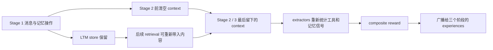

# 做过、做成、做对：AgeMem 的 reward 看见了什么？

Agent Memory Study editors · 2026-09-12 · 已执行的官方函数级审计

AgeMem 的 unified policy 将 memory operations 和回答一起训练。要理解它，除了看最终 answer score，也需要追问：reward 用什么记录判断前面发生过什么？本研究直接运行固定官方版本的 reward 模块，用 16 个原创消息输入检查操作结果、context 留存与质量代理量之间的关系。

这不是训练复现，也没有执行真实 memory mutation。我们把成功、失败、取消、历史保留/清空等消息交给未修改的官方函数，观察它们实际返回的 stats 与 reward。14 例无 judge，2 例使用固定返回值的本地 stub；没有模型、网络调用、私有对话、GPU 或新增 dependency。

## 来源与执行边界

- 论文：[ACL 2026 正式版](https://aclanthology.org/2026.acl-long.981/)，27 页，重点依据 §§3.3–3.5、Appendix A.2–A.3、C.4。
- 官方代码：[y1y5/AgeMem，98f563f907d67b2f2436e3ae7b7ceff32e482814](https://github.com/y1y5/AgeMem/tree/98f563f907d67b2f2436e3ae7b7ceff32e482814)。论文与公开源码分别固定，不认定这个 revision 就是论文实验版本。
- 实际执行：[my_reward.py](https://github.com/y1y5/AgeMem/blob/98f563f907d67b2f2436e3ae7b7ceff32e482814/trinity/common/workflows/memory_reward/my_reward.py)，直接加载整个 stdlib-only 模块，调用三个 extractors 和 `ThreeStageRewardCalculator.calculate_total_reward`。
- 只读调用关系：[train_hotpotQA.py](https://github.com/y1y5/AgeMem/blob/98f563f907d67b2f2436e3ae7b7ceff32e482814/trinity/common/workflows/memory_context/train_hotpotQA.py#L348) 及 [multi_step_grpo_advantage.py](https://github.com/y1y5/AgeMem/blob/98f563f907d67b2f2436e3ae7b7ceff32e482814/trinity/algorithm/advantage_fn/multi_step_grpo_advantage.py)。没有初始化或运行完整 workflow、memory store 或 optimizer。
- [执行前协议](protocol.md)、[全部输入与固定预期](fixtures.json)、[runner](audit.py)、[完整输出](results.json)。运行环境为 macOS arm64 / Python 3.13.3，标准库。

## 观察结果

| 配对 / 控制 | 直接输出 | 能说明什么 |
| --- | --- | --- |
| Update True / False | `updated_count=1`，两者 `r_maintenance=1` | 当前 extractor 数的是返回文字前缀，没有检查操作是否成功 |
| Delete True / False | `deleted_count=1`，两者 `r_maintenance=1` | 失败删除消息也触发维护分项 |
| 取消删除 / 无维护 | `r_maintenance=0` | 控制区分了取消格式和含 `memory_deleted:` 的失败格式 |
| 保留 / 移除 Stage 1 add 消息 | `added_count` 为 1 / 0；fallback `r_storage` 为 0.3 / 0 | 统计依赖最终消息可见性；这不意味着 LTM store 被清空 |
| 使用 / 明确忽略同一检索内容 | 两者 `used_retrieved_memory=true`，fallback `r_relevance=0.5` | 相邻 assistant 回复是利用代理，不验证是否采用或采用得正确 |
| 原问题 / 无关新问题 | 两者两个 preservation flags 都为 true | 从当前 context 找 user message 再检查其词语，未与原任务输入独立对齐 |
| 没有 user message | `preserved_user_query=false`，`preserved_key_info=true` | 总 preservation 被前者压到 0；不能仅凭后者判断信息保留 |
| prose 仅提及 Summary_context | tool count 为 1，removed messages 为 0，preventive 分量为 1 | 工具名出现可能充当调用和预防操作的代理 |
| 失败 update + 相同 retrieval，固定 judge 返回 0 / 1 | relevance 为 0 / 1，maintenance 两者仍为 1 | 有 judge 时 relevance 可以覆盖 fallback；维护指示量仍独立于该评分 |

16 例全部匹配执行前固定预期，输入均未被修改。这里的“通过”表示可重现地刻画了源码行为，不表示源码满足语义正确性要求，更不是 16/16 任务成功率。

维护项是 trajectory 中存在操作时的二值奖励，不是每调用一次就叠加。训练调用点的 memory weight 为 0.15，分项等权，因此本例贡献 `0.15 × 1/3 = 0.05`。成功与失败消息长度不同，总 reward 的 compression 项有很小差异；我们比较维护分项，未把总分强说成完全相等。

## 为什么 context reset 还会影响评价



调用点先清空 `self.context_messages`，最后从它计算三个 stats，再将同一 total reward 分给所有阶段的 experiences。`extract_memory_stats` 接收 `memory_manager` 参数却没有读取它。因此在本组输入中，历史 add 消息消失后不会从 store 自动补回“曾经做过 add”的统计。完整运行中后续 retrieval 或新增操作可能重新提供部分证据；我们没有测量恢复比例。

这与论文防止 residual-context shortcut 的目的并不冲突：给 policy 的 context 可以清空，但评价历史行为需要另一个完整的观测来源。这一建议尚未在官方训练器中实现或做收益对照。

## 原文、公开源码与本地结果分开读

论文 Eq. (24) 已经把 maintenance 定义为是否进行了 update/delete，而非正确性判断。本文实测进一步检查了公开 extractor 如何把消息变成这个布尔值。源码还使用 task/tool/context/memory 四项 `0.5/0.2/0.15/0.15` 权重及 reward clipping；它与 Appendix C.4 的三项各 1/3 不同。本测试使用调用点原值，不将差异解释成论文实验错误。

论文 §3.4 的同 trajectory advantage 广播，及源码同名实现的只读检查，说明这是延迟学习信号；它不提供逐次 mutation 的独立因果贡献。本审计没有运行 optimizer，不能推出 RL 无效、模型必然利用奖励漏洞，或这些代理一定改变论文排行榜。

## 复跑

在 repo 根目录，无 upstream checkout 时只能验证已保存 receipt：

```bash
python3 -B research/agemem-reward-observation-audit/audit.py --verify-checked
```

要实际重新执行官方模块，准备固定版本的外部 checkout，然后运行：

```bash
git clone https://github.com/y1y5/AgeMem /path/to/AgeMem
git -C /path/to/AgeMem checkout 98f563f907d67b2f2436e3ae7b7ceff32e482814
python3 -B research/agemem-reward-observation-audit/audit.py \
  --source-repo /path/to/AgeMem --check
```

去掉 `--check` 可将 fresh JSON 输出到 stdout；源目录留在 AMS 外。runner 检查 pinned revision 与相关 tracked files，未复制、修改或安装上游源码。`--verify-checked` 不导入官方模块；Reading Room CI 只执行这个 receipt 检查。
