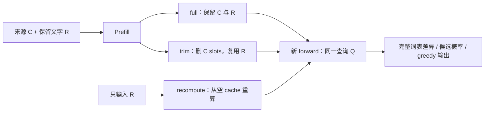

# 来源删了，计算影响还在吗？

日期：2026-09-18。作者：Agent Memory Study editors。

**已执行原创单模型机制实验。** 固定 SmolLM2-135M-Instruct，在 4 对合成来源、5 类查询、
5 种 cache 处理下完成最终 200 次 greedy continuation。20 组配对中，仅替换已经被裁掉的来源事实，
仍使 next-token 分布改变；3 组首个 greedy token 改变。重新计算与屏蔽来源的控制通过。
这证明本实验中 retained cache 存在来源内容依赖，不证明所有模型会这样，也不证明旧事实仍可正确恢复。

灵感来自 [C2C v2 §3.2.1 / Eq. 2](https://arxiv.org/html/2510.03215v2#S3.SS2.SSS1)。
这里没有运行 C2C fuser、双模型通信、论文 benchmark 或权重级 machine unlearning。
[协议](protocol.md)保留首次 inference 前的设计及查看早期输出后的两次 amendment；
最终[固定输入](fixtures.json)含审阅后加入的问题，不称为盲确认性重复。
[执行历史](execution-history.json)保留中间运行的数值控制失败；
[源码审计](../c2c-source-contract-audit/README.md)是另一项证据。

## 对照怎么构成

`C` 是来源事实，`R` 是不重复事实值的保留文字，`Q` 是裁剪后才实际 forward 的问题。
每对只把 `C` 中一个值替换，例如 `red` / `blue`；`R`、`Q` 与更正后的第三个值 `green` 完全相同。
四对来源均长 9 tokens。分段分别编码，receipt 保存实际 token IDs。



| 条件 | R 的计算来源 | Q 可见的旧 cache | 用途 |
| --- | --- | --- | --- |
| full | C + R | C + R | 原始完整上下文参照 |
| trim | C + R | 仅 R | 来源 slots 撤回后复用 |
| recompute | 仅 R | 新计算的 R | 来源未参与计算的参照 |
| neutral_trim | N + R | 仅 R | 等长前缀的附加控制 |
| masked_trim | C + R，但预先屏蔽所有对 C 的 attention | 仅 R | 阻断来源计算路径的负控制 |

`N` 是重复九次的单 token ` note`；它只是长度控制，不能被理解成对模型完全无影响。
因此主要内容比较是 **trim(Ca) vs trim(Cb)**，而不是 trim vs 中性文本。

所有 R 的 RoPE `position_ids` 从 9 起，Q 从 `9 + |R|` 起。
裁剪后的 physical `cache_position` 则从实际 `|R|` 起，mask 覆盖 `|R| + |Q|`。
两种索引承担不同职责。每次 forward 使用独立 clone；不用裁剪前的末 token logits 当新答案。

## 实际结果

[完整 compact receipt](results.json)保存 200 条输入、token IDs、位置合同、候选序列 log probability、
top-5、八 token 上限的 greedy output、各层 K/V 差异与配对差异；不隐藏答非所问的输出。
下面的 TV 是两个**完整词表 next-token 概率分布**之间的 total variation。

| 来源配对 | 当前事实 | 状态改变后的当前 | 状态改变前的过去 | 纠错后的真值 | 先前记录说了什么 |
| --- | ---: | ---: | ---: | ---: | ---: |
| beacon：red / blue | 0.018861 | 0.028312 | 0.027576 | 0.039770 | 0.047083 |
| lamp：black / white | 0.017130 | 0.033621 | 0.039277 | 0.024205 | 0.031334 |
| route：north / south | 0.029565 | 0.026652 | 0.027998 | 0.027428 | 0.026593 |
| gate：left / right | 0.064661 | 0.032404 | 0.047893 | 0.059406 | 0.053703 |

五列均为 TV。`state_change` 中旧值曾经为真；`record_correction` 明确说旧记录错误，
此时询问旧记录内容不等于承认过去世界的事实。两个角色在 fixtures 与 receipt 中分别记录。

- 20/20 配对的 max absolute logit difference 为 **0.433175–1.087516**，超过预定 `1e-4` 容差。
- 第一层 suffix K/V 不随前缀内容变化，后续层出现差异；符合“下游层接收前缀条件化”的机制解释。
- recompute 的 20/20 来源配对完全相同；masked_trim vs recompute 的 logits 与各层 K/V 差均为 **0**。
- full 及 shifted-recompute 的 split / 整段 forward、native / repacked cache、query 前半段独立运行、
  同长度未来 token 置换等控制的相应最大差均为 **0**；所有层 R→C masked attention mass 为 **0**。
- 首个 greedy token 的 3 次变化分别出现在 beacon/current_state、lamp/prior_world_state、gate/updated_current_state。
  其余 17 组首 token 相同仍有分布差异，不能把 argmax 相同当成无影响。

当前题 full 条件能在展示输出中给出各自事实值；但历史题和部分更正题的 full 行为并不可靠。
裁剪后的许多输出只是重复 R 的措辞，说明这里检测到的数值依赖不等于可用的事实记忆。
候选序列的概率与自由生成的回答也不同：模型可能先生成整句话，其首词不是候选值。

审阅后增加的探索性指标为 `E = (m(Ca) − m(Cb)) / 2`，其中
`m(C) = log P(a | C) − log P(b | C)`，使用完整候选序列分数。
当前事实题在 full 条件下四对都满足各自正确候选领先；trim 的 E 分别为
`0.050762 / 0.103756 / 0.113995 / −0.112139`。前三对方向与来源值一致，gate 反向。
所以即使分布差异清楚，也不能统称为“成功保存知识”。其余题先检查 receipt 的
`full_candidate_eligible_both`，不合格时不解释为裁剪造成的行为失败；更正题的 E 衡量旧值倾向，
不等于第三个正确答案的收益。该指标在首轮输出被查看后提出，属探索性分析。

## 数值控制与执行历史

首轮 120 个 float32 输出见 [initial-summary.json](initial-summary.json)。加强位置与因果控制后，
中间的 200 输出 float32 运行有两项超出原定 `1e-4`：shifted split 最大 `1.449585e-4`，
query 截短最大 `1.487732e-4`。这些失败没有改阈值抹掉。
定点诊断中，同 shape 的未来 token 置换在两种精度下均不改变前半段；提高矩阵运算精度后，
相应 split 控制归零，支持 shape 相关数值误差的解释。

最终全部 200 输出用 float64 model parameters / hidden states 重跑，阈值仍为 `1e-4`，
九类控制全部通过。上游 RoPE frequency 与 eager softmax 内部仍用 float32，
因此不是端到端 float64 算术。最终 receipt、失败统计与诊断的关系见 [execution-history.json](execution-history.json)。

## 身份、环境与复跑

- 模型：[HuggingFaceTB/SmolLM2-135M-Instruct](https://huggingface.co/HuggingFaceTB/SmolLM2-135M-Instruct/tree/12fd25f77366fa6b3b4b768ec3050bf629380bac)，
  revision `12fd25f77366fa6b3b4b768ec3050bf629380bac`；30 层 Llama architecture。
- CPU / float64 parameters 与 hidden states（上述内部 float32 例外）/ eager attention / eval /
  4 threads / seed 0；torch 2.8.0、transformers 4.51.3。
- 使用原创 cloze prompts，没有 chat template、训练、采样、外部推理 API 或私人数据。
- 权重 SHA-256 与固定 revision 的官方 LFS metadata 一致。
  [model-files.json](model-files.json)列出 fresh run 要求的确切文件身份；它不证明行为正确。

仅检查保存 receipt 的结构、fixture binding、候选概率算术、探索性 E / eligibility 与派生统计，不加载模型：

```bash
python3 -B research/c2c-cache-retraction-study/study.py --verify-checked
python3 -B -m unittest discover -s research/c2c-cache-retraction-study -p 'test_*.py'
```

Fresh inference 需要 repo 外的隔离环境与固定权重。先安装 [requirements.txt](requirements.txt)，
再按以下方式下载指定文件，避免下载训练状态或其他格式的重复权重：

```python
from huggingface_hub import snapshot_download
snapshot_download(
    "HuggingFaceTB/SmolLM2-135M-Instruct",
    revision="12fd25f77366fa6b3b4b768ec3050bf629380bac",
    local_dir="/path/to/model",
    allow_patterns=["config.json", "generation_config.json", "tokenizer.json",
                    "tokenizer_config.json", "special_tokens_map.json", "vocab.json",
                    "merges.txt", "model.safetensors"],
    token=False,
)
```

```bash
python3 -B research/c2c-cache-retraction-study/study.py \
  --model-dir /path/to/model \
  --dtype float64 \
  --output /path/to/fresh-results.json \
  --raw-logits /path/to/fresh-logits.pt
```

全词表 logits 以 tensor 文件写到调用者指定的 repo 外路径；公开 receipt 保存 compact measurements，
不随库打包模型或二进制 tensor。离线 receipt 检查不重新计算这些分布，也不能独立证明真实 inference；
fresh runner 才加载固定权重并重新计算。不同硬件或数值栈可能有小幅差异，不承诺 bitwise portability。

## 结论边界

可以说：在本模型、固定 inputs、相同位置与可见 cache 长度下，删去来源 slots 不足以消除
它对后续状态与分布的影响；从未见过来源的重算和阻断 attention 提供了相应控制。

不能说：恢复了被删除的事实、所有更正失败、源内容不可被真正撤回、权重携带了新知识、
隐私删除已经被绕过、C2C benchmark 被复现，或来源失效后的所有影响都能由本 runner 的重算策略处理。
本研究是固定的一次 forward / continuation 干预，未测试 serving 生命周期、并发失效或跨请求缓存。
