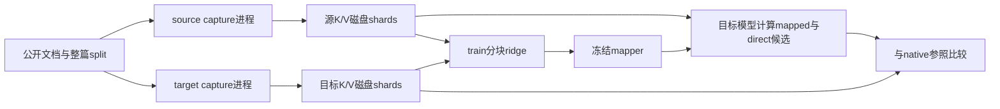

# Cross-model KV prefill reuse — 分阶段研究 runner

**状态：runner 已实现，本地随机模型与数据准备验收通过。真实 Qwen3 mapper 尚未拟合，尚无迁移质量结果。**

这个 runner 为 [arXiv:2608.03893v1](https://arxiv.org/html/2608.03893v1) 的 Qwen3-0.6B → 1.7B 小配对研究准备完整执行路径：公开文档切分、两个模型先后采集、磁盘分块拟合、三路 held-out 评价。模型、样本量、序列长度和固定 k 都缩小了；不声称复现论文表格。协议、指标定义与解释边界见 [protocol.md](protocol.md)。

## 已执行证据

2026-09-18 的公开摘要见 [validation.json](validation.json)，完整输出在操作者的仓库外run目录；以下数字不包含pretrained迁移效果。

| 检查 | 实测结果 | 解释范围 |
| --- | --- | --- |
| runner unittest | 21项通过 | 磁盘阶段、精确256/192/191/64索引、train-only fit、候选隔离、数值与续跑身份 |
| 随机模型CLI smoke | 六阶段完成，native/full最大logit差 `7.15e-7` | 真实Qwen模块、随机权重与synthetic tokens |
| 随机BF16单target完整256-token闭环 | raw native/full的logit与NLL差均为0；同shape未来干预首logit差为0 | 191-token落盘cache + 64-token fresh forward；不是pretrained验证 |
| RoPE往返诊断 | K最大绝对差约0.01224；输出KL约`1.72e-6` | 同一随机BF16模型；说明往返cache不能冒充原始native |
| 公开语料prepare | 200候选中157篇足够长，选出64/8/16；两tokenizer一致，88个截断序列无完全重复 | 只读取tokenizer，不加载pretrained权重 |
| 1024→1024 FP64 ridge tensor probe | 256行分四批，统计张量形状不增长；单进程峰值约262MiB | 单个K或V solver，不是完整runner或模型峰值 |

实现期间发现并修正过索引、head聚合与BF16基线问题；随机输出已被查看，属于工程控制，不是盲测质量结论。原有reader验证也通过，但不运行本目录的PyTorch实验。

## 计算与资料流



source capture结束后才启动target；fit不加载模型；evaluate只加载target。每篇文档一个shard，每目标层一个mapper artifact。模型、原始语料、完整cache与本地run目录放在Git checkout外。

K的content坐标以FP32保存；held-out target还保存未修改的post-RoPE K作为native基线。去/补RoPE的有限精度误差单独报告，避免把重新编码的cache误当作未经改动的目标原生状态。

## 环境与外部依赖

Python 3.12，PyTorch 2.8.0，Transformers 4.51.3；本目录的requirements记录本地已验收的CPU依赖。模型加载固定请求`low_cpu_mem_usage=True`；本地随机模型在未安装accelerate时成功执行，先前Linux资源探针环境另含accelerate 1.10.1。加载失败会直接报告，不自动关闭低内存模式。Linux CPU主机应先从[PyTorch官方CPU wheel源](https://pytorch.org/get-started/previous-versions/#v280)安装CPU版torch，避免无意下载CUDA runtime。

回归与部分cache表示使用独立社区项目 [souvikDevloper/kvbridge](https://github.com/souvikDevloper/kvbridge/tree/949d81d7861e998d5c42db68d7567cc70e2e58c5) 的固定源码checkout，不是论文作者官方代码。其源码保留上游Apache-2.0条款，本repo没有vendor这些文件，也不为其背书完整正确性。

```bash
git clone https://github.com/souvikDevloper/kvbridge.git /path/to/kvbridge-upstream
git -C /path/to/kvbridge-upstream checkout 949d81d7861e998d5c42db68d7567cc70e2e58c5
python3 -m venv /path/to/experiment-venv
/path/to/experiment-venv/bin/python -m pip install -r research/kv-prefill-transfer/requirements.txt
```

以下变量都由操作者替换为自己的路径；原始数据与输出选择仓库外目录：

```bash
export KVPREFILL_UPSTREAM=/path/to/kvbridge-upstream
AMS_STUDY=/path/to/agent-memory-study/research/kv-prefill-transfer
EXPERIMENT=/path/outside-checkout/kv-prefill-run
PYTHON=/path/to/experiment-venv/bin/python
```

## 先验收，再使用真实权重

```bash
"$PYTHON" -B "$AMS_STUDY/runner.py" smoke --out "$EXPERIMENT/smoke" --keep
"$PYTHON" -B -m unittest discover -s "$AMS_STUDY" -p 'test_runner.py' -v
"$PYTHON" -B "$AMS_STUDY/probe_fit_memory.py" \
  --upstream "$KVPREFILL_UPSTREAM" --out "$EXPERIMENT/fit-memory.json"
"$PYTHON" -B "$AMS_STUDY/probe_native_cache.py" --random \
  --upstream "$KVPREFILL_UPSTREAM" --out "$EXPERIMENT/random-native-256"
```

`smoke` 使用本地随机小Qwen3，不下载pretrained权重；走与真实实验相同的阶段与artifact接口。它的NLL/KL只检验计算路径，不说明映射质量。`probe_fit_memory.py` 以真实k1特征宽度1024、输出宽度1024进行小批次FP64求解；它的RSS只属于单次tensor求解，不等于模型或完整pipeline峰值。

## 准备公开数据

```bash
"$PYTHON" -B "$AMS_STUDY/fetch_corpus.py" --out-dir "$EXPERIMENT/corpus"
cp "$AMS_STUDY/configs/qwen3-0.6b-to-1.7b.json" "$EXPERIMENT/config.json"
cd "$EXPERIMENT"
"$PYTHON" -B "$AMS_STUDY/runner.py" prepare --config config.json --out run
```

`fetch_corpus.py` 使用[官方Rows API](https://huggingface.co/docs/dataset-viewer/rows)，从 [FineWeb-Edu sample-10BT](https://huggingface.co/datasets/HuggingFaceFW/fineweb-edu)取前200个候选。每页检查`x-revision`为`87f09149ef4734204d70ed1d046ddc9ca3f2b8f9`，拒绝partial/truncated响应，并保存原始响应和输入身份。这个候选池来自该子集的固定位置，不代表从整个FineWeb-Edu独立均匀抽样。语料沿用上游ODC-By及CommonCrawl条款；原始网页内容不随本repo再发布。

`prepare`在两套固定tokenizer上一致编码，过滤不足256tokens的文档后，按完整文档得到64 train / 8 validation / 16 test。这里的三份split都是从上游train语料派生的实验split，不能称作上游官方test set。固定配置里的`data.path`相对当前工作目录，所以上例先`cd`到EXPERIMENT。

## 独立阶段

在长时校准前，先用一篇validation文档检查真实target的native路径；该命令只加载target，不拟合mapper，不读取test：

```bash
"$PYTHON" -B "$AMS_STUDY/probe_native_cache.py" \
  --upstream "$KVPREFILL_UPSTREAM" --run "$EXPERIMENT/run" \
  --out "$EXPERIMENT/native-check"
```

它保存原始post-RoPE cache并读回，记录191/64分段与255-token full forward的logit/NLL差、首token、同shape未来干预、RoPE往返误差和进程峰值RSS。`complete-measured`表示测量完成；检查实际数值和资源后再决定校准预算，不代表迁移质量通过。不要将这份单文档输出标为完整target capture。

```bash
"$PYTHON" -B "$AMS_STUDY/runner.py" capture --run "$EXPERIMENT/run" --role source
"$PYTHON" -B "$AMS_STUDY/runner.py" capture --run "$EXPERIMENT/run" --role target
"$PYTHON" -B "$AMS_STUDY/runner.py" fit --run "$EXPERIMENT/run"
"$PYTHON" -B "$AMS_STUDY/runner.py" evaluate --run "$EXPERIMENT/run" --split validation
# 固定实现/config/mapper后，才执行一次最终test并保留其已查看状态。
"$PYTHON" -B "$AMS_STUDY/runner.py" evaluate --run "$EXPERIMENT/run" --split test
```

这些命令是完整实验接口，**不是已执行的真实迁移结果**。不要并发启动capture，不要在共享服务主机上取消资源上限。Linux可用`systemd-run`把每个阶段限定在明确的CPU/RAM/swap/时间预算内；真实阶段的运行时间需单独估算，单模型资源探针的预算不代表整个pipeline预算。

首轮固定k1、sum-lambda .01、FP64 statistics。若改k、样本量、precision或数据切分，建立新的run目录与身份；不要覆盖已查看的test或让旧cache/mapper静默混入新协议。已完成shard只在相同身份下续用，部分失败保留为失败。

续跑身份还绑定runner源码、PyTorch/Transformers版本与eager backend；改动这些执行条件后需要重新采集，不能把旧shard混入新结果。prepared token文件在读取时校验其prepare阶段记录的身份。mapper的`observations`记录采样token行数，`train_documents`另记整篇文档数。

## 报告含义

- `native_target` 为目标原生prefix状态，`mapped`由source+冻结mapper得到，`direct_source`是去源/补目标RoPE后不经学习的source状态。
- 所有分支在同一文档上评分64个continuation tokens。先缓存191tokens，再fresh forward `x[191:255]`，标签是`x[192:256]`。
- per-document mean NLL、相对native的PPL ratio、`KL(native||candidate)`、top1 agreement与首tokenp_gold是不同指标，不合并成论文accuracy retention。
- K/V reconstruction与输出指标使用同一批held-out文档；具体R²聚合与attention-output指标的范围以receipt为准，不用缓存cosine替代attention-output cosine。
- 这次runner交付不把新论文提升为AMS `worked`。来源撤回/残余影响跨模型实验、自由生成、原论文benchmark与端到端服务加速均未执行。

统一`tools/verify_reader.py`不运行这个需要PyTorch及外部checkout的runner；请使用上面的独立验收命令。随机receipt与真实模型receipt不可混称。
