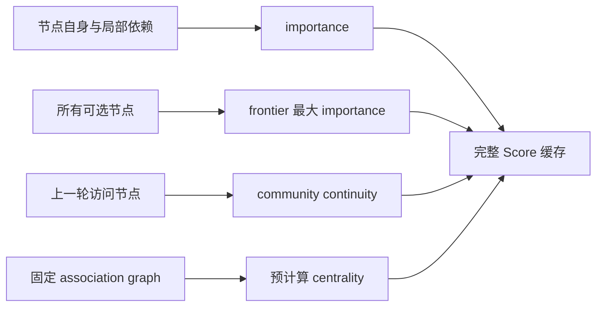

# 邻居没变，为什么分数过期了？

Agent Memory Study editors · 2026-09-12

这份阅读实验接续 [MOSAIC：Accurate and Efficient Long-Term Memory for LLM Agents，arXiv v1](https://arxiv.org/abs/2607.16211v1)。论文 §3.3 用 neighbor-conditioned stability（NCS）支持局部重算：改变一个节点，只需要重新处理它和依赖它的邻居。§3.4 的实际分数又加入了 frontier 归一化与上一轮 community。

**局部缓存能否保持正确，取决于缓存值的全部依赖是否局部。** 这里直接计算公开 Eq. (1)，比较全量评分与两种失效策略。四个抽象节点、九个原创场景均公开；没有作者源码、模型调用或 benchmark rerun。

## 亲自运行

Python 3 标准库即可；本次使用 macOS arm64 / Python 3.13.3。无需网络、下载模型或安装依赖。

```bash
python3 -B research/mosaic-score-dependency-study/study.py
python3 -B research/mosaic-score-dependency-study/study.py --check
python3 -B -m unittest discover -s research/mosaic-score-dependency-study -p 'test_*.py'
```

[执行前协议](protocol.md)记录干预、控制和结论边界；[fixtures.json](fixtures.json)保存 before / after 输入；[study.py](study.py)为唯一评分实现；[results.json](results.json)包含输入副本、frontier、dirty set、评分项、完整分数、排名、选择及差异；[test_study.py](test_study.py)提供八项行为测试。`--check` 会重新计算并比较全部保存结果。默认运行重写本目录 `results.json`；用 `--output /path/to/fresh-results.json` 可另存一份。

## 同一个分数，三类依赖

实验按原文 Eq. (1) 与 §4.3 的权重计算：

```text
Score(v) = 0.5 × I(v) / max(I(u) for u in current frontier)
         + 0.3 × T(v)
         + 0.2 × [community(v) == community(previous)]
```



association graph 为 `a ↔ b`、`c ↔ d`，前一对属于 left，后一对属于 right。centrality 固定为各 `1/4`，与该规则图的均匀 PageRank 相容；这里不实际运行 PageRank 或 Leiden。importance 是指定的正整数，不冒充作者的 importance 更新算法。两个解锁场景额外加入 prerequisite `d → c`。

`full` 在 after-state 对全部 frontier 重新评分。`graph-dirty` 只重算改变节点、它们的有向边接收者及新加入 frontier 的节点，其他完整分数沿用 before-state 缓存。`dependency-aware` 在此基础上比较 frontier 最大 importance 和 previous community，任一改变就重算当前 frontier。

每种处理都先重建 eligibility，正确移除已 resolved 节点、加入 prerequisite 已满足的节点。实验故意将**可选集合是否正确**与**集合中分数是否过期**分开。previous-pointer 干预是明确的 controller-context 对照，不声称模拟了完整对话发生过程。

## 已执行结果

九个场景各运行三种 after-state 处理，共 27 组处理输出；它们是定向反例和控制，不是独立随机样本或错误率估计。

| 场景 | 只按图失效的 stale nodes | 只按图失效 / 全量的选择 | 补全依赖后 |
| --- | --- | --- | --- |
| 远处最大值 10→20 | a | a / c | 全部分数一致 |
| 最大值节点退出 frontier | a | a / a | 全部分数一致 |
| previous 跨 community | a、c | a / c | 全部分数一致 |
| 远处非 frontier 节点变化 | 无 | a / a | 全部分数一致 |
| 自身非最大 importance 8→6 | 无 | a / a | 全部分数一致 |
| 完全不变 | 无 | a / a | 全部分数一致 |
| previous 改变但 community 相同 | 无 | a / a | 全部分数一致 |
| prerequisite 解锁新的最大值 | a | a / c | 全部分数一致 |
| prerequisite 解锁非最大值 | 无 | a / a | 全部分数一致 |

**远处最大值的变化。** 初态只有 a、c 在 frontier，`I(a)=8`、`I(c)=10`，previous 为 b。a 的完整分数是 `0.5×8/10 + 0.3×1/4 + 0.2 = 27/40 = 0.675`。c 的 importance 改成 20 后，a 自身与邻居 b 均未改变，但正确分数降为 `19/40 = 0.475`。c 为 `23/40 = 0.575`。只按图失效会保留 a 的 0.675，因此选 a；全量重算选 c。

**选择相同仍可能有错。** 最大值 c 退出 frontier 后，只剩 a。两种策略当然都选 a，但正确分数已变为 `31/40 = 0.775`，旧缓存仍为 `27/40`。只测试最终 top-1 会漏掉这个不一致。

**节点不变，controller context 可以改变。** previous 从 left 的 b 改成 right 的 d 时，所有 entity fields 相同，图 dirty set 为空；a 失去 0.2 continuity bonus，c 获得 0.2。旧缓存仍选 a，重新计算则选 c。反过来，previous 从 b 改为同 community 的 a，continuity term 不变，不必仅因 pointer identity 改变就刷新分数。

**新节点已正确加入，仍可能漏掉旧节点。** prerequisite 解锁 importance=20 的 c 时，三种策略都正确加入并计算 c、移除 d；图局部失效仍漏掉 a 的新归一化分母。解锁 importance=4 的 c 时，最大值仍为 8，图局部处理则与全量一致。

八项行为测试包含手算分数、stale score 与 stale choice 的区别、controller context、合法自身变化、无关变化、新旧 frontier、有向依赖传播以及输入不变/可复跑。依赖补全策略在全部九例与全量分数和排名一致。

## 可以带走的设计判断

NCS 是一个关于函数依赖的条件，图的存在不自动让每个派生值满足它。如果只缓存局部 importance，在选择时重新组合归一化与 continuity，那么完整 Score 的失效契约与本实验不同；如果把全局量显式加入 dependency graph，也可以覆盖它们。这里仅测试一种容易检查的修复：全局评分上下文改变时失效整个当前 frontier。

这不是性能优化成果。runner 扫描全部节点、重建 frontier 并求最大值；输出中的 `rescored` 数量不等于端到端计算复杂度，也不说明论文的 0.58 秒 search latency。我们没有测量 embedding、LLM extraction、conflict checking、write、retrieval 或 answer generation。

本次在 arXiv record、全文与标题 / 作者 / arXiv ID 的定向搜索中没有定位到可归属于该论文的官方实验 repo。因而结论只到**公开公式与声明的图局部失效条件之间，需要补充依赖契约**；不能宣称已发现作者线上代码 bug、复现 QA 差异或推翻整套 NCS。§3.9 的 submodular coverage 与 propagation 定理需要另行核查假设和证明，本实验不验证它们。

在真实系统上，下一步是固定实现与输入流，比较分项缓存、显式依赖失效和全量重算的完整状态、输出与端到端成本。这个迁移对照尚未执行。
