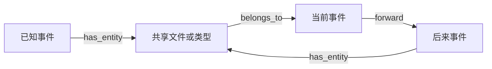

# 还没发生的事，能改变此刻的判断吗？

Agent Memory Study editors · 2026-09-08

这份阅读实验接续 Liu 等的 [*Do Proactive Agents Really Need an LLM to Decide When to Wake and What to Anchor?*，arXiv v1](https://arxiv.org/abs/2605.30152v1)。论文把“何时唤醒”和“带上哪些实体”交给同一个 temporal graph encoder。这样做有一个必要条件：**在时刻 t 计算的结果，应当只依赖当时已经观察到的事件。**

原文 Appendix B.1 简述推理时移除 backward 时间边；更完整的 Appendix E.7 还要求屏蔽未来事件、新引入实体的输入及 hidden-state contribution。这里用三个原创小图检查这个条件为什么需要落到整条信息路径上。**这不是作者代码审计，也不证明论文实际实现泄漏未来。**

## 亲自运行

需要 Python 3 标准库；本次在 macOS arm64 / Python 3.13.3 执行。无需网络、模型、GPU、pip 包或 API key。

```bash
python3 -B research/proactive-prefix-study/study.py
python3 -B research/proactive-prefix-study/study.py --check
python3 -B -m unittest discover -s research/proactive-prefix-study -p 'test_*.py'
```

[fixtures.json](fixtures.json) 保存全部原创输入；[study.py](study.py) 是唯一传播实现；[results.json](results.json) 保存 30 次运行的节点、边、逐层数值及比较结果；[test_study.py](test_study.py) 包含 8 项行为测试。`--check` 会实际重建并传播，比较完整 topology、layer states 和 readouts。

这些数值是 **0 或 1 的抽象标量，经三轮同步邻居均值传播得到的精确分数**。没有 text embeddings、可训练参数、attention、GATv2、trigger probability、routing ranking 或下游 LLM。它们用于构造可检验的反例，不近似论文的模型效果。

## 为什么去掉时间反向边还不够

每个事件连接它涉及的实体，实体也能把信息传给事件。同一个文件或类型节点会被多个事件共享。即使不存在 future → current 的 backward 时间边，完整会话图里仍可能存在这条两跳路径：



本实验每图有两个已知事件，分别带信号 1、0，实体信号均为 0。未来分支分别是不添加事件、添加信号为 0 的事件、添加信号为 1 的事件。三个场景只改变未来事件连接的实体：共享同一文件、仅共享 writing 类型、完全不同的文件。事件序号表示观察先后，不把“同一时间戳”误当作“已经观察到”。

在同一输入上比较三种处理：

| 处理 | 具体操作 | 当前观察量 |
| --- | --- | --- |
| `drop-backward-only` | 用完整图，仅移除 backward 时间边 | 当前事件及已知实体的最终数值 |
| `zero-future-states` | 另将未来节点的输入和每一层状态归零，但保留其邻接边及均值分母 | 同一组当前／已知节点 |
| `prefix-graph` | 先截取已观察事件，再从此前缀构图和传播 | 同一组当前／已知节点 |

三种处理都移除了 backward 时间边，都包含 self loops。第二种是**明确构造的不完整屏蔽控制**，不是对 Appendix E.7 的官方实现判定。第三种用前缀重建作为易检查的参照；实际系统也可以用正确覆盖消息、归一化和 readout 的 mask 实现同一因果要求，本实验没有测试这种优化实现。

## 实际结果

下表的“不变”要求两个未来分支都与只看前缀的结果一致，比较对象包含当前事件和全部已知实体。

| 未来事件经过哪里 | 只去 backward 边 | 再逐层归零未来状态 | 前缀重建 |
| --- | --- | --- | --- |
| 同一个文件节点 | 改变 | 改变 | 不变 |
| 不同文件，但共享 writing 类型 | 改变 | 改变 | 不变 |
| 完全无关的文件（控制） | 不变 | 不变 | 不变 |

**内容绕行。** 在共享文件场景里，只去 backward 边后，未来信号从 0 改为 1，第二轮起就改变当前事件的值。第一轮当前事件尚未变化，与 future → entity → current 的两跳路径相符。

**结构也会影响结果。** 将未来节点在每层都归零后，改变未来信号本身不再改变输出，但“添加这个零节点”仍有影响：共享文件的第一轮均值从 **1/3 变成 1/4**。分子没有增加信息，分母却包含了一个当时还不存在的邻居。只比较两种未来文本会漏掉这个问题；还需要与**没有未来节点的前缀运行**比较。

**参照需要对过去有反应。** 三个场景的前缀重建都对未来保持不变；将已知第一个事件的信号从 1 改为 0，三个结果又都改变。这个控制排除了“输出永远是常数，所以看似没有未来泄漏”的假通过。

30 次运行由 3 场景 × 3 处理 × 3 未来分支，加上 3 次合法过去变化构成。它们是有限、相互关联的反例与控制，不能换算为泄漏率、accuracy 或 trigger 性能排名。

## 回到论文：这份结果能支持什么

这份实验支持一个可带走的检查方法：冻结观察前缀，在同一模型条件下追加不同未来事件，再对照真正只包含此前缀的运行。检查范围应包括共享实体、类型节点、归一化分母、缓存和最终可参与 routing 的候选。这里只实际测试了原创 mean-propagation 图；缓存、attention 和 routing candidate selection 未测试。

原文确实在 E.7 提出了未来输入与 hidden-state contribution 的屏蔽，不能把 B.1 的简述误读为它只删除时间边。我们在本次 arXiv、PDF、作者主页、作者博客及标题定向搜索中未定位到可归属于这篇实验的官方实现或 checkpoint，因此无法核验其具体 masking。作者博客是[这个架构选择的背景说明](https://xz-liu.github.io/blog/knowledge-graphs/)，不是实现代码。

对实际主动助手，还要分别观察 graph gate 是否放行、LLM 是否输出非空任务、任务是否被接受，以及人是否愿意被打扰。论文主表 F1 经过 released reward model 评价；它与裸 trigger AUC、真实打扰成本属于不同证据。固定真实 checkpoint 的前缀重放、自然事件接入和用户评价仍是**未执行的迁移研究**。
