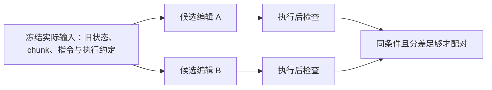

# 同一条编辑，面对的是同一份记忆吗？

Agent Memory Study editors · 2026-09-08

[读 TRUSTMEM 札记](https://indeliblevivi.github.io/agent-memory-study/?material=trustmem-consolidation) · [原文 v1](https://arxiv.org/abs/2606.25161v1) · [逐项执行结果](results.json)

TRUSTMEM 把记忆更新放到显微镜下：一次编辑是否遗漏新信息、破坏有效旧信息、或添加没有依据的内容？它还要求，在**同一 chunk、同一旧状态**下比较候选编辑。这份小实验把这个比较条件单独取出来，让读者看到一种容易写进评估脚本的错误。

这是 AMS 原创的确定性教学实验。没有使用 TRUSTMEM 官方实现、训练权重、LLM verifier 或 benchmark trajectories，没有复现论文效果。下面的分数由显式事实和人工设定的义务计算，不能解释成自然语言可靠性评分。

## 先看一个反例

新输入相同：deadline 是 Friday。候选动作也相同：`[]`，不作任何编辑。

| 候选 | 旧记忆 | 执行后 | 三项检查的均值 |
| --- | --- | --- | --- |
| already-stored | 已有 deadline=Friday | 所需事实仍存在 | 1 |
| missing-noop | 空 | 必要事实未存入 | 2/3 |

第一条 no-op 合理，第二条遗漏新信息。差异来自旧状态。如果只按任务与 chunk 序号汇集候选，再取最高与最低分，就会得到一组“优选 `[]`、拒绝 `[]`”的假比较。

原文 §3.4 / Eq. (3) 的 ranking loss 要求两个输出共享 prompt。若硬把这两个相同输出放进同一个 prompt，它们的 log-probability 差恒为零；这项 ranking loss 为 `log(2)`，不能提供区分这两个动作的梯度。若改用各自不同的 prompt，那又已经改变了原文该式的比较条件。本实验没有执行模型或自动微分；这是对该反例和公式的代数解释。

我们的 `same_prompt` 检查拒绝这组候选。然后固定空的旧状态，再比较“写入 Friday”和“no-op”：输入相同、动作不同，才得到一组有效比较。**拒绝不匹配的候选只是停止错误归因；共享前缀后重新采样，才补得回真正的比较机会。**



## 实际测了什么

[`fixtures.json`](fixtures.json) 是唯一的场景定义，含 10 个刻意构造的 transition。事实使用键值映射，不从语言推断；所有新事实都必须保留，未被更正或撤回的旧事实都视为重要，chunk 的明确更正与撤回按设定拥有决定权。

[`audit.py`](audit.py) 中只有一个 toy executor：`write` 要求目标不存在，`revise` / `prune` 要求目标存在；一个序列中任一动作无效就保持原状态。这是本实验自己的原子执行约定，不是从论文推断出来的实现行为。

三个诊断分别检查新事实是否保留、有效旧事实是否保留，以及输出是否只含当前可支持的事实。合法更正不会被要求保留已失效的值。无动作可以合法；保留已撤回值则会失败。成功执行时，三项布尔值的均值是教学分数；执行失败时为零。**这个等权公式由 AMS 定义，论文没有给出相同的 verifier 聚合公式。**

| 控制 | 本次观察 |
| --- | --- |
| 明确更正 Tuesday → Friday | 旧值不再要求保留，timezone 仍保留，三项通过 |
| 更正时顺手删掉 timezone | coverage 通过，preservation 失败 |
| 更正时凭空加 room=Blue | faithfulness 失败 |
| 显式撤回 room 后删除 / 留存 | 删除通过；留存失效事实不通过 |
| 对不存在的目标 revise | 执行失败，原状态不变 |
| 相同 chunk、不同旧状态、相同 no-op | 粗分组产生退化 pair；完整 prompt 检查拒绝 |
| 同一空状态下 write / no-op | 两种配对路径都接受；写入胜出 |
| 同一旧状态下更正 / 丢失条件 | 两种配对路径都接受；保留有效条件胜出 |
| 两条等效更正 | 同分，不制造偏好 pair |

`pair()` 接收一个**拟议候选组**。它拒绝组内 prompt 不一致的情况；真实系统应按所有实际 conditioning inputs 分组或重新采样，不应把整个 batch 直接塞进这个 helper。此处 prompt 只包含声明的 instruction、executor contract、旧状态与 chunk；没有检验 tokenizer、序列化顺序或真实训练框架的状态快照。

完整结果有 10 行 transition 与 4 组双路径配对。唯一故意失效的粗分组是反例控制；它不代表 TRUSTMEM 的代码。本轮在原文、arXiv 记录、作者主页和定向 GitHub 搜索中未找到可归属于该论文的官方实现或 released trajectories，因此无法判断作者实际采样是否存在这种错误。同名 PyPI 软件不被当作论文实现。

## 论文数字复核

[`paper-values.json`](paper-values.json) 保存从原 PDF Tables 1–3 与 Figure 2 人工读取、视觉核对的数值，脚本做精确分数运算：

- Mem-α validation：66.3 − 61.9 = **4.4** 分。
- MemoryAgentBench：65.7 − 59.2 = **6.5** 分。
- HaluMem extraction F1：69.45 − 57.31 = **12.14** 分。
- Figure 2 最佳比较对象因错误类型而异：omission 比 Mem-T，corruption 比 MemAgent，hallucination 比 AtomMem。
- 由图中已舍入数值计算，相对下降约为 **40.059%、79.104%、50%**；绝对下降分别为 **5.40、0.53、0.01 个百分点**。它们与论文 headline 的舍入值相容，不构成独立效果复现。

这些比例来自 §4.5 / Appendix D 的 **GPT-4o-mini、temperature 0、major severity** 判断；一个 transition 可以有多种错误。它们不涵盖 minor errors，也不是逐事实错误率。论文没有在这里给出足够的逐方法 transition 数量与原始判定来恢复整数错误计数或不确定性；尤其不能用 0.01% 自行倒推样本数。

## 本地复跑

Python 3.9+ 标准库即可，无安装、网络、模型或凭证需求。本次执行环境为 macOS arm64、Python 3.13.3。

```bash
python3 -B research/trustmem-transition-study/audit.py
python3 -B research/trustmem-transition-study/audit.py --check
python3 -B -m unittest discover -s research/trustmem-transition-study -p 'test_*.py' -v
```

第一条生成 fresh JSON；第二条与公开保存的 [`results.json`](results.json) 比较。8 项测试另查合法更正、无依据新增、撤回、完整 prompt 比较、相同输出反例、同条件正控制、严格 margin 边界、等分、原子执行与 fixture 不变性。没有用测试数代表研究证据规模。

## 怎样把它带走

先用自己已有的更新器保存**实际输入、候选动作、执行后的状态**，分别看遗漏、保留和依据。做候选 A/B 比较时冻结同一份输入；这比只保留一个最终“可信度分数”更容易定位问题。随后在包含解析错误、事实重要性分歧和合法冲突的真实任务中评估，才有资格讨论效果。

这份实验只能证明所声明的有限 contract 和反例。它没有学习“什么重要”、识别合法更正的权威、检查任意自然语言语义、证明局部视图覆盖全库，也没有评估长期任务效用、预算、延迟、隐私删除或生产可靠性。TRUSTMEM 训练与评测 judge 的偏差仍需独立研究。

本材料由人机协作研究流程中的 AMS 编者制作；输入为公开论文数值和 AMS 原创 synthetic fixtures。没有新增许可授权，沿用仓库 [NOTICE](../../NOTICE.md) 中的权利边界。
