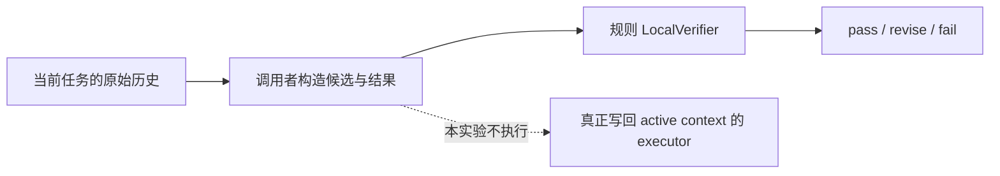

# 回来的还是原来那条证据吗？

Agent Memory Study editors · 2026-09-08

这份实验伴随 [Verifiable Memory 精读](https://indeliblevivi.github.io/agent-memory-study/?material=verifiable-memory)。它直接调用作者公开实现里的 `LocalVerifier`，检查 `SelectEpisode`、`Summarize`、`Filter` 的判定边界。输入是 AMS 原创的书房通知，没有私人 memory 或 benchmark 数据。

**已执行：12 个函数级样例，7 个正常或拒绝控制、5 个被接受的反例。** 这些是有意构造的对照，不是随机抽样；不能把 5/12 当作系统错误率。`pass` 是上游函数返回的 verdict，不是本站认定内容正确。没有执行实际 memory executor、LLM verifier、训练或任务评测。

## 为什么从历史恢复读到这里

[论文 v1](https://arxiv.org/abs/2608.03137v1) 区分长期条目 M、当前 context C 与同一任务的历史 H。`Retrieve` 从 M 取回，`SelectEpisode` 从 H 取回；原文的归属与来源要求见 Appendix A.2–A.4、Tables 6–7（PDF pp. 12–14）。论文还要求摘要保留含义、过滤保留必要信息。训练用的 DeepSeek-V3.2 local/global verifier 与执行前约束检查是不同环节，评测时关闭前者（Appendix F，PDF pp. 22–29）。

公开代码提供的是规则 verifier。我们要检验一个更窄的问题：当它接收候选和结果时，`pass` 究竟证明了什么？



## 固定的来源与执行范围

- 作者 repo：[Sun-SYSU-24/VerMem](https://github.com/Sun-SYSU-24/VerMem)，由 arXiv record 链接；固定 commit `4782751c79faa08421a27c23b4d02c591bc3357d`。
- 实际执行：[local_verifier.py](https://github.com/Sun-SYSU-24/VerMem/blob/4782751c79faa08421a27c23b4d02c591bc3357d/00_verifiers/local_verifier.py) 的 `verify` 与三个 STM 分支，以及原始 `memory_operations.py` / `memory_schemas.py`。模块自行声明不修改状态、不调用模型。
- 静态阅读了 [reward projection](https://github.com/Sun-SYSU-24/VerMem/blob/4782751c79faa08421a27c23b4d02c591bc3357d/02_reward/verifier_gated_reward.py)：它另行组织 visible items、proposal/result 与附加 credit。这条调用链没有在本实验执行，不能把单函数结果等同于完整 reward 或部署结果。
- 环境：macOS arm64，Python 3.13.3 标准库；取得源码后测试不联网，无第三方安装、模型、GPU 或 API。只加载所需三个模块，不执行上游 package 的广泛初始化或 training driver。
- 本目录不包含上游源码或论文 PDF。所需外部 checkout 由读者准备；runner 检查 commit 及所执行文件是否与 HEAD 一致。

## 观察到了什么

完整输入在 [fixtures.json](fixtures.json)，实际返回在 [results.json](results.json)。仅去掉每次随机生成的 `verification_id`；其余报告字段全部保留。`expectedVerdict` 记录阅读此版本代码后预期的行为，不代表我们希望系统接受这些输入。

| 对照 / 反例 | 实际 verdict | 这次能说明什么 |
| --- | --- | --- |
| 同任务、候选内、原内容 | pass | 正常选择路径可通过 |
| 非空候选表之外的 ID | fail | 该条件下执行候选 ID membership 检查 |
| task-b 条目已经混入 task-a 候选表 | pass | 此函数不独立建立候选的任务归属 |
| 候选 ID 不变，正文 17:00 改成 19:00 | pass | 仅匹配 ID 没有核对返回正文 |
| 候选表为空，却返回一个条目 | pass | 空表使 membership 分支不执行 |
| 选中两条，max_items 为 1 | fail | 数量上限控制生效；未测试 token budget |
| 不提供 scores | revise | scores 缺失会请求修改 |
| 17:00 的短摘要 | pass | 正常摘要路径可通过 |
| 同长度摘要将 17:00 改成 19:00 | pass | 长度与来源 ID 检查未证明语义忠实 |
| 过长摘要，提供实际字符长度比 | revise | compression_ratio 越界检查生效 |
| 删除项保留原 priority 0.9 | fail | 高优先级保护分支生效 |
| 原输入仍有 priority 0.9，结果同 ID 项省略该字段 | pass | 保护检查读取结果项，没有回查原输入项 |

所有调用前后 proposal/result/context 均未改变；这是 verifier 的只读行为，不是原子提交或回滚测试。`task-a` / `task-b` 与 item metadata 的 `run_id` 是 fixture 明示的归属标记，不声称它们是上游 item schema 承诺支持的 scope 字段。这个样例把责任定位在候选构造边界，不能证明真实系统发生跨任务泄漏。

## 在另一台机器复跑

需要 Python 3 与 Git。从 AMS repo 根目录执行；临时 clone 位于 Git worktree 外：

```bash
vermem_audit_dir="$(mktemp -d)"
git clone https://github.com/Sun-SYSU-24/VerMem.git "$vermem_audit_dir/VerMem"
git -C "$vermem_audit_dir/VerMem" checkout --detach 4782751c79faa08421a27c23b4d02c591bc3357d
python3 -B research/vermem-verifier-boundary-audit/audit.py \
  --upstream "$vermem_audit_dir/VerMem" --check
```

成功输出：

```text
PASS: 12 upstream verifier cases match saved results; 7 controls; 5 accepted counterexamples
```

去掉 `--check` 会输出新的完整 JSON，不会覆盖 checked-in 结果。`--check` 会重新调用上游函数并比较结果，不是只读取旧 receipt。上游其他版本不在本实验结论范围内；runner 会拒绝不匹配的 commit 或被修改的执行文件。

## 读者可以借用的判断

**从候选表取到某个 ID，还需要知道正文和归属由谁保证。** 若在自己的系统中采用历史恢复，可以让 policy 只选择引用，再由掌握当前任务历史的 executor 回查原内容、保留来源、检查 context budget 后提交。保护标记也应从权威输入读取。这个设计建议来自本次代码边界观察；本站没有实现该 executor，也没有测量实际任务收益。

摘要的语义忠实仍需另一种证据：长度、ID 和形式合法都不能单独证明它。论文描述的语义 verifier、运行前约束与本次规则函数应分别看待。论文评测逐 episode 清空 M/C/H（§5；Appendix C.2），所以本次也不作跨会话记忆、端到端安全或论文结果真伪的推断。
